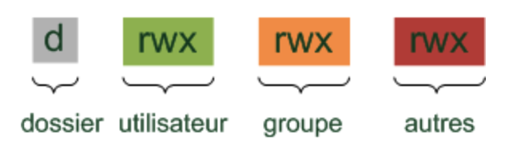
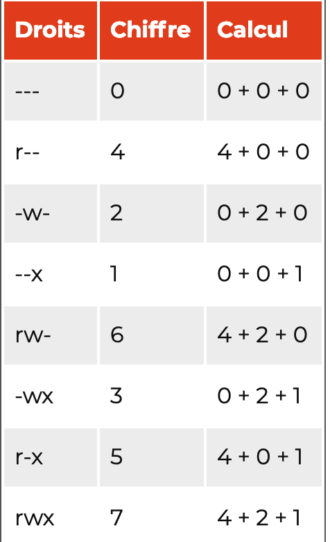
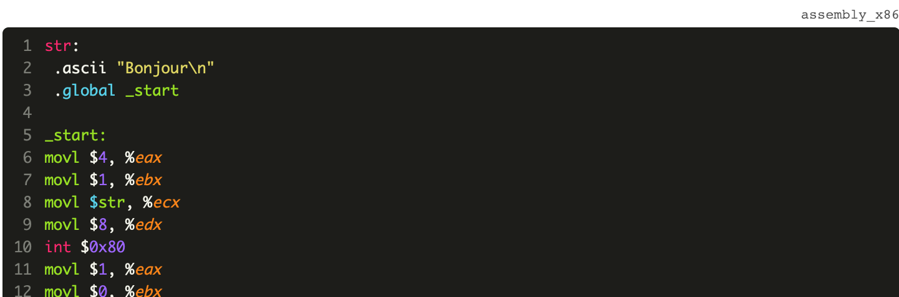

# The complete web developer

[](http://makeapullrequest.com)

----

- [The complete web developer](#the-complete-web-developer)
	- [Markdown cheetsheet](#markdown-cheetsheet)
	- [github](#github)
	- [Vim](#vim)
	- [Command line](#command-line)
	- [online courses](#online-courses)
	- [Books](#books)
	- [Bases](#bases)
	- [Some routines](#some-routines)
	- [Difference between let and var (ECMAScript 6 2015)](#difference-between-let-and-var-ecmascript-6-2015)
	- [template literal +](#template-literal)
	- [Type conversion](#type-conversion)
	- [if](#if)
	- [function vs procedure vs methode](#function-vs-procedure-vs-methode)
	- [Exercices](#exercices)
		- [Chapter 1](#chapter-1)
		- [Chapter 2](#chapter-2)
		- [Chapter 3](#chapter-3)
		- [Chapter 4](#chapter-4)
		- [Chapter 5](#chapter-5)
		- [Chapter 6](#chapter-6)
		- [Chapter 7](#chapter-7)
		- [Chapter 8](#chapter-8)
		- [Chapter 9](#chapter-9)
	- [Vocabulaire](#vocabulaire)

## Markdown cheetsheet
[link](https://en.support.wordpress.com/markdown-quick-reference/)

## github
git pull origin master --allow-unrelated-histories

show branch:  export PS1="\\w:\$(git branch 2>/dev/null | grep '^*' | colrm 1 2)\$ "

## Vim

[substitute](http://vim.wikia.com/wiki/Search_and_replace)

:%s/foo/bar/g
:  Find each occurrence of 'foo' (in all lines), and replace it with 'bar'.

:s/foo/bar/g
:  Find each occurrence of 'foo' (in the current line only), and replace it with 'bar'.

:%s/foo/bar/gc
:  Change each 'foo' to 'bar', but ask for confirmation first.

:%s/\<foo\>/bar/gc
:  "Change only whole words exactly matching 'foo' to 'bar'; ask for confirmation.

zz
:  make text center, zt zb = top and bottom

13gg
:  go to 13th line
## Command line


ls -a  = ls --all (only in linux)  ls -i

ls + nom du dossier

date cal

<kbd>ctrl + r</kbd> search in the past commands

pwd which pwd ls -FG ls -lhtr  ls -larth  (larth)

head tail -f tail -f -s 3 syslog

touch a b c  mkdir  a b mkdir -p animaux/vertebres/chat

cp fichierbidon mondossier/    cp -R cp *.jpg mondossier/(wildcard)

rm a b -i -f -r

cd = go to home cd - = go to the previous directory  du -sh

cat -n  ln (lien physique) ln -s (lien symbolique fonctionnant aussi sur les repertoires)

sudo su adduser deluser passwd deluser --remove-home patrick addgroup   usermod -aG amis patrick

chown patrick rapport.txt  chgrp amis rapport.txt  chown patrick:amis rapport.txt   -R

chmod  chmod 600 rapport.txt   -R aussi



commande -d -a -U -h = commande -daUh

commande --parametre long --another parametre long

commande -p 14  = commande --parametre=14

[someKeyboardShortkey](https://openclassrooms.com/fr/courses/43538-reprenez-le-controle-a-laide-de-linux/38076-entrer-une-commande)

[directoryStructure](https://openclassrooms.com/fr/courses/43538-reprenez-le-controle-a-laide-de-linux/38351-la-structure-des-dossiers-et-fichiers)

[lessRaccourci](https://openclassrooms.com/fr/courses/43538-reprenez-le-controle-a-laide-de-linux/38696-manipuler-les-fichiers)

[droits](https://openclassrooms.com/fr/courses/43538-reprenez-le-controle-a-laide-de-linux/39044-les-utilisateurs-et-les-droits)


## online courses

- [ ]	[bash](https://openclassrooms.com/fr/courses/43538-reprenez-le-controle-a-laide-de-linux/39267-nano-lediteur-de-texte-du-debutant)  


- [ ] [javascriptCourseComplete](https://www.udemy.com/the-complete-javascript-course/)

- [ ] [webDevlopperFromZerotoMastery](https://www.udemy.com/the-complete-web-developer-zero-to-mastery/)

- [ ] [webDevBootcamp](https://www.udemy.com/the-web-developer-bootcamp/)

- [ ] [modernReactWithRedux](https://www.udemy.com/react-redux/)

- [ ] [javascriptTheWeirdParts](https://www.udemy.com/understand-javascript/)

- [ ] [thejsWayAnswer](https://github.com/oc-courses/intro-javascript) [thejsWayEnglish](https://github.com/bpesquet/thejsway) [thejsWayFrench](https://openclassrooms.com/fr/courses/2984401-apprenez-a-coder-avec-javascript?status=published)  


- [ ] [regularExpressions](https://regexone.com/)
- [ ] [comprendreLeWeb](https://openclassrooms.com/fr/courses/1946386-comprendre-le-web)
- [ ] [GithubOpenCLassroom](https://openclassrooms.com/fr/courses/2342361-gerez-votre-code-avec-git-et-github)


## Books
[eloquent javascript](https://www.amazon.com/Eloquent-JavaScript-3rd-Introduction-Programming/dp/1593279507/ref=sr_1_7?ie=UTF8&qid=1548950313&sr=8-7&keywords=javascript)

[eloquentOnlineVersion](http://eloquentjavascript.net/)

[Secrets of the JavaScript Ninja](https://www.amazon.com/dp/1617292850/ref=sspa_dk_detail_1?psc=1)

[javascriptThegoodparts](https://www.amazon.com/JavaScript-Good-Parts-Douglas-Crockford/dp/0596517742/ref=sr_1_1?s=books&ie=UTF8&qid=1548950389&sr=1-1&keywords=javascript+the+good+parts)


## Bases

Un programme informatique (également appelé application ou logiciel) est une liste d'ordres indiquant à un ordinateur ce qu'il doit faire.

ce sont les ordres données à la machine, qu'on appelle également des instructions. L'ensemble des fichiers contenant les instructions du programme constitue son code source. Programmer, c'est donc écrire le code source d'un programme, d'où l'emploi du terme coder.

Un langage de programmation définit une manière de donner des ordres à un ordinateur. Un peu comme une langue vivante, tout langage a son vocabulaire (un ensemble de mots-clés, chacun jouant un rôle spécifique) et sa grammaire (un ensemble de règles définissant la manière d'écrire des programmes dans ce langage).

Le seul langage de programmation directement compréhensible par un ordinateur est le langage machine, également appelé assembleur. Il s'agit d'instructions élémentaires liées à un type de processeur (le "cerveau" de l'ordinateur) et qui permettent de manipuler directement la mémoire de la machine(x86=32位处理器).



* On nomme exécution le fait de demander à un ordinateur de réaliser les ordres contenus dans un programme.

* Avec certains langages, les lignes du code source sont traduites en assembleur puis exécutées ligne après ligne par un programme spécifique appelé interpréteur. On dit alors que le langage est interprété. Python et PHP sont des exemples de langages interprétés.

* Une autre possibilité consiste à créer à partir de l'ensemble du code source un fichier directement exécutable (sous Windows, il portera l'extension .exe) en utilisant un programme intermédiaire appelé compilateur. On parle alors de langage compilé. Les langages C et C++ sont des exemples de langages compilés.

* Enfin, une troisième option consiste à utiliser un pseudo-compilateur pour générer à partir du code
source un ensemble de fichiers pouvant être exécutés sur n'importe quelle plate-forme supportant
l'environnement. C'est le cas du langage Java et des langages de la plate-forme Microsoft .NET
(VB.NET, C#, etc).


## Some routines

```javascript
console.log("Hello from JavaScript!");
console.log("Hello from JavaScript!");
console.log("Let's do some math");
console.log(4 + 7);
console.log(12 / 0);
console.log("Goodbye!");
console.log("Hello from JavaScript!");
// console.log("Let's do some math");
console.log(4 + 7);
// console.log(12 / 0);
console.log("Goodbye!");
```
```javascript
let a;
console.log(a);  // undefined
```
## Difference between let and var (ECMAScript 6 2015)

```javascript
var x = 10;
// Here x is 10
{
  var x = 2;
  // Here x is 2
}
// Here x is 2

var x = 10;
// Here x is 10
{
  let x = 2;
  // Here x is 2
}
// Here x is 10

```

```javascript
let num1 = 0;
{
  num1 = 1; // OK : num1 is declared in the parent block
  const num2 = 0;
}
console.log(num1); // OK : num1 is declared in the current block
console.log(num2); // Error! num2 is not visible here
```
## template literal +
```javascript
const country = "France";
console.log(`I live in ${country}`); // Show "I live in France"
const x = 3;
const y = 7;
console.log(`${x} + ${y} = ${x + y}`); // Show "3 + 7 = 10"
```
## Type conversion

```javascript
const g = "five" * 2;
console.log(g); // Show NaN
const h = "5";
console.log(h + 1); // Concatenation: show the string "51"
const number = Number("5");
const string = String("6");
console.log(i + 1); // Numerical addition: show the number 6
const f = 100;
// Show "Variable f contains the value 100"
console.log("Variable f contains the value " + f);
const name = prompt("Enter your first name:");
alert(`Hello, ${name}`);
const temp1 = 36.9;
const temp2 = 37.6;
const temp3 = 37.1;
console.log(temp1, temp2, temp3); // Show "36.9 37.6 37.1"
```
## if

```javascript
const nombre = 3;
if (nombre > 0) {
  console.log(nombre + " est positif");
}
else {
  console.log(nombre + " est négatif ou nul");
}
```

```javascript
const nombre = -3;
if (nombre > 0) {
  console.log(nombre + " est positif");
} else { // nombre <= 0
  if (nombre < 0) {
    console.log(nombre + " est négatif");
  } else { // nombre === 0
    console.log(nombre + " est nul");
  }
}
if (nombre > 0) {
  console.log(nombre + " est positif");
} else if (nombre < 0) {
  console.log(nombre + " est négatif");
} else {
  console.log(nombre + " est nul");
}

if ((nombre >= 0) && (nombre <= 100)) {
  console.log(nombre + " est compris entre 0 et 100");
}
if ((nombre < 0) || (nombre > 100)) {
  console.log(nombre + " est en dehors de l'intervalle [0, 100]");
}
if (!(nombre > 100)) {
  console.log(nombre + " est inférieur ou égal à 100");
}

const meteo = prompt("what's the weather outside");
switch (meteo) {
  case "soleil":
    console.log("Sortez en t-shirt.");
    break;
  case "vent":
    console.log("Sortez en pull.");
    break;
  case "pluie":
    console.log("Sortez en blouson.");
    break;
  case "neige":
    console.log("Restez au chaud à la maison.");
    break;
  default:
    console.log("Je n'ai pas compris !");
}

const x = "abc";
switch (x) {
  case "abc":
    console.log("x vaut abc");
    // pas de break : on passe au bloc suivant !
  case "def":
    console.log("x vaut def");
    break;
}

```

## function vs procedure vs methode

Une fonction qui ne renvoie pas de valeur est parfois appelée une procédure.

```javascript
console.log(Math.min(4.5, 5)); // 4.5
console.log(Math.min(19, 9));  // 9
console.log(Math.min(1, 1));   // 1

console.log(Math.random()); // Un nombre aléatoire entre 0 et 1
```

```javascript
const stylo = {
  type: "bille",
  couleur: "bleu",
  marque: "Bic"
};

stylo.couleur = "red";
console.log(`J'écris avec un stylo ${stylo.type} ${stylo.couleur} de marque ${stylo.marque}`);

stylo.prix = "3";
// "Mon stylo coûte 2.5 euros"
console.log(`Mon stylo coûte ${stylo.prix} euros`);

const aurora = {
  nom: "Aurora",
  sante: 150,
  force: 25
};

// "Aurora a 150 points de vie et 25 en force"
console.log(`${aurora.nom} a ${aurora.sante} points de vie et ${aurora.force} en force`);

console.log("Aurora est blessée par une flèche");
aurora.sante = aurora.sante - 20;

console.log("Aurora trouve un bracelet de force");
aurora.force = aurora.force + 10;

// "Aurora a 130 points de vie et 35 en force"
console.log(`${aurora.nom} a ${aurora.sante} points de vie et ${aurora.force} en force`);

// Modélisation d'un compte bancaire

const compte = {
  titulaire: "Alex",
  solde: 0,

  // Ajoute un montant au solde
  crediter(montant) {
    this.solde += montant;
  },

  // Renvoie la description du compte
  decrire() {
    return `titulaire: ${this.titulaire}, solde: ${this.solde}`;
  }
};

// "titulaire: Alex, solde: 0"
console.log(compte.decrire());

compte.crediter(250);
compte.crediter(-80);

// "titulaire: Alex, solde: 170"
console.log(compte.decrire());
```
## Exercices

[Answerkey](https://github.com/xiaoouwang/theCompleteWebDeveloper/blob/master/answer.js)

### Chapter 1
* Ecrivez un programme qui affiche votre nom, puis votre âge.
[answer](https://github.com/oc-courses/intro-javascript/blob/gh-pages/chapitre1_exercice1.js)

* Ecrivez un programme qui calcule et affiche le résultat de l'addition, de la soustraction, de la multiplication et de la division de 6 par 3.
[answer](https://github.com/oc-courses/intro-javascript/blob/gh-pages/chapitre1_exercice2.js)

* Observez le programme puis tentez de prévoir les valeurs affichées lors de son exécution.
[answer](https://github.com/oc-courses/intro-javascript/blob/gh-pages/chapitre1_exercice3.js)
```javascript
// Prédiction de résultat

console.log(4 + 5);
console.log("4 + 5");
console.log("4" + "5");
```

Vérifiez vos prévisions en l'exécutant.
### Chapter 2
* [liste des mots reserves dans javascript](https://developer.mozilla.org/fr/docs/Web/JavaScript/Reference/Mots_r%C3%A9serv%C3%A9s)
* Prediction des valeurs
```javascript
// Prédiction de valeurs

let a = 2;
a -= 1;
a++;
let b = 8;
b += 2;
const c = a + b * b;
const d = a * b + b;
const e = a * (b + b);
const f = a * b / a;
const g = b / a * a;

```
* Convert from Celsius to Fahrenheit

Complétez le programme pour convertir une tempéraure des degrés Celsius en degrés Fahrenheit.

> C'est à Daniel Gabriel Fahrenheit que l'on doit l'invention des thermomètres en graduation Fahrenheit. Au début, ses thermomètres sont à l'alcool (1709), mais il remplace rapidement l'alcool par du mercure (1715), permettant à ses outils de mesure de fournir des données comparables. En 1742, un autre scientifique, Anders Celsius, propose une nouvelle graduation au thermomètre. La conversion entre les échelles est donnée par [°F] = [°C] x 9/5 + 32.

> code d'origine
> [answer](https://github.com/oc-courses/intro-javascript/blob/gh-pages/chapitre2_exercice2.js)
```javascript
// Celsius - Fahrenheit

const tempCel = 37.1;
```

* Complétez le programme afin qu'il permute les valeurs des deux variables.

Il existe plusieurs solutions à cet exercice. Astuce : vous n'êtes pas limité(e) à l'utilisation de deux variables.
> code d'origine
> [answer](https://github.com/oc-courses/intro-javascript/blob/gh-pages/chapitre2_exercice3.js)

```javascript
let nombre1 = 5;
let nombre2 = 3;

// Tapez votre code ici (sans rien modifier d'autre !)

console.log(nombre1); // Doit afficher 3
console.log(nombre2); // Doit afficher 5

```
### Chapter 3

* Jour suivant

Affichez le jour suivant.
> code d'origine
> [answer](https://github.com/oc-courses/intro-javascript/blob/gh-pages/chapitre3_exercice1.js)

```javascript
const jourActuel = "lundi";
let jourSuivant = "";
// Ecrivez votre code ici
```

* Baccalauréat

Complétez ce programme pour qu'il affiche le résultat du baccalauréat en fonction de la moyenne du candidat :

Si elle est strictement inférieure à 10, il est recalé.

Si elle est comprise entre 10 et 12, il est reçu.

Si elle est supérieure ou égale à 12, il est reçu avec mention

> code d'origine
> [answer](https://github.com/oc-courses/intro-javascript/blob/gh-pages/chapitre3_exercice2.js)

```javascript
const moyenne = 11;
// entrez votre code ici
```
* Heure suivante

Complétez ce programme pour afficher l'heure qu'il sera dans une seconde.

Attention, ce programme est moins simple qu'il en a l'air : validez votre solution en la testant avec les entrées suivantes. Vous devez obtenir les résultats indiqués.

14h17m59s => 14h18m0s
6h59m59s => 7h0m0s
23h59m59s => 0h0m0s (minuit)

> code d'origine
> [Answer](https://github.com/oc-courses/intro-javascript/blob/gh-pages/chapitre3_exercice3.js)

```javascript
let heures = 14; // Faire varier cette variable entre 0 et 23
let minutes = 17; // faire varier cette variable entre 0 et 59
let secondes = 59; // faire varier cette variable entre 0 et 59

// Ajoutez votre code ici

```
### Chapter 4
* Tournez manege

Complétez ce programme pour qu'il fasse 10 tours de manège en affichant le numéro du tour à chaque tour :

    Le manège démarre
    C'est le tour numéro 1
    C'est le tour numéro 2
    ...
    C'est le tour numéro 10
    Le manège s'arrête

> code d'origine
> [answer](https://github.com/oc-courses/intro-javascript/blob/gh-pages/chapitre4_exercice1.js)
```javascript
const nbTours = 10;

console.log("Le manège démarre");

// Ajoutez votre code ici

console.log("Le manège s'arrête");
```
* Table de multiplication

Complétez le programme pour afficher la table de multiplication du nombre choisi.
> code d'origine
> [answer](https://github.com/oc-courses/intro-javascript/blob/gh-pages/chapitre4_exercice2.js)
```javascript
const nombre = 7; // Faites varier cette variable entre 1 et 10

console.log(`Table de multiplication de ${nombre}`);
// Ajoutez votre code ici
```

* FizzBuzz

Ecrivez un programme qui affiche tous les nombres entre 1 et 100 avec les exceptions suivantes :

> Il affiche "Fizz" à la place du nombre si celui-ci est divisible par 3.
> Il affiche "Buzz" à la place du nombre si celui-ci est divisible par 5 et non par 3.
> Il affiche "FizzBuzz" à la place du nombre si celui-ci est divisible à la fois par 3 et par 5.

Vous pouvez utiliser l'opérateur modulo % qui renvoie le reste de la division d'un entier par un autre.

Cet exercice constitue un **test d'embauche** classique qui élimine un nombre significatif de candidats. Accrochez-vous pour le réussir !

> code d'origine
> [answer](https://github.com/oc-courses/intro-javascript/blob/gh-pages/chapitre4_exercice3.js)​

### Chapter 5
* Carre d'un nombre

Carré d'un nombre

Complétez le programme pour que les fonctions carre1() et carre2() calculent et renvoient le carré du nombre passé en paramètre.
> code d'origine
> [answer](https://github.com/oc-courses/intro-javascript/blob/gh-pages/chapitre5_exercice1.js)​
```javascript
// Renvoie le carré de x
function carre1(x) {
  // Ajoutez votre code ici
  return 0;
}

// Renvoie le carré de x
const carre2 = x => 0; // Ajoutez votre code ici

console.log(carre1(0)); // 0
console.log(carre1(2)); // 4
console.log(carre1(5)); // 25

console.log(carre2(0)); // 0
console.log(carre2(2)); // 4
console.log(carre2(5)); // 25

```
* Minimum de deux nombres

Minimum de deux nombres

En supposant que la fonction JavaScript Math.min()n'existe pas, complétez le programme pour que la fonction min() renvoie le plus petit des deux nombres passés en paramètres.
> code d'origine
> [answer](https://github.com/oc-courses/intro-javascript/blob/gh-pages/chapitre5_exercice2.js)​
```javascript
// Ajoutez votre code ici
console.log(min(4.5, 5)); // 4.5
console.log(min(19, 9));  // 9
console.log(min(1, 1));   // 1
```
* Calculatrice

Complétez le programme pour que la fonction calculer() gère les 4 opérations mathématiques de base : addition, soustraction, multiplication et division.
> code d'origine
> [answer](https://github.com/oc-courses/intro-javascript/blob/gh-pages/chapitre5_exercice3.js)​
```javascript
// Ajoutez votre code ici

console.log(calculer(4, "+", 6));  // 10
console.log(calculer(4, "-", 6));  // -2
console.log(calculer(2, "*", 0));  // 0
console.log(calculer(12, "/", 0)); // Infinity
```
### Chapter 6
* Expérience du personnage

Complétez le programme pour ajouter à l'objet aurora défini dans le cours une propriété nommée xp représentant son expérience. Sa valeur initiale est de 0.

L'expérience doit apparaître dans la description du personnage.
[answer](https://github.com/oc-courses/intro-javascript/blob/gh-pages/chapitre6_exercice1.js)

```javascript
// Ajoutez votre code ici

// "Aurora a 150 points de vie, 25 en force et 0 points d'expérience"
console.log(aurora.decrire());

console.log("Aurora apprend une nouvelle compétence");
aurora.xp += 15;

// "Aurora a 150 points de vie, 25 en force et 15 points d'expérience"
console.log(aurora.decrire());
```
* Modélisation d'un chien

Complétez ce programme pour ajouter la définition de l'objet chien.
[answer](https://github.com/oc-courses/intro-javascript/blob/gh-pages/chapitre6_exercice2.js)

```javascript
// Ajoutez votre code ici

// "Crockdur est un mâtin de Naples mesurant 75 cm"
console.log(`${chien.nom} est un ${chien.race} mesurant ${chien.taille} cm`);

// "Tiens, un chat ! Crockdur aboie : Grrr ! Grrr !"
console.log(`Tiens, un chat ! ${chien.nom} aboie : ${chien.aboyer()}`);

```
* Modélisation d'un compte bancaire

Complétez ce programme pour créer un objet compte ayant les propriétés suivantes :

Une propriété titulaire valant "Alex".
Une propriété solde valant initialement 0.
Une méthode crediter() ajoutant le montant passé en paramètre (éventuellement négatif) au solde du compte.
Une méthode decrire() renvoyant la description du compte.
Utilisez cet objet pour afficher sa description, le créditer de 250, puis le débiter de 80, et enfin afficher de nouveau sa description.

[answer](https://github.com/oc-courses/intro-javascript/blob/gh-pages/chapitre6_exercice3.js)
### Chapter 7
* Les Trois Mousquetaires

Les Trois Mousquetaires

Ecrivez un programme qui :

* crée un tableau nommé mousquetaires contenant les noms des trois mousquetaires, Athos, Porthos et Aramis ;
* affiche le nom de chaque mousquetaire à l'aide d'une boucle for ;
* ajoute au tableau le mousquetaire d'Artagnan ;
* affiche de nouveau le nom de chaque mousquetaire, cette fois à l'aide de la méthode forEach().
* supprime Aramis du tableau ;
* affiche le nom de chaque mousquetaire avec une boucle for-of.

[answer](https://github.com/oc-courses/intro-javascript/blob/gh-pages/chapitre7_exercice1.js)

* Complétez le programme pour calculer puis afficher la somme des valeurs du tableau nombres.
[answer](https://github.com/oc-courses/intro-javascript/blob/gh-pages/chapitre7_exercice2.js)

```javascript
const nombres = [11, 3, 7, 2, 9, 10];

// Ajoutez votre code ici

```

* Instructions

Maximum d'un tableau

Complétez le programme pour qu'il calcule et affiche ensuite la plus grande valeur présente dans le tableau.
[answer](https://github.com/oc-courses/intro-javascript/blob/gh-pages/chapitre7_exercice3.js)

```javascript
const valeurs = [3, 11, 7, 2, 9, 10];

// Ajoutez votre code ici

```
### Chapter 8
* Nombre de voyelles

Complétez le programme en y ajoutant une fonction compterVoyelles() qui prend un mot en paramètre et renvoie son nombre de voyelles.

> Une voyelle en majuscules reste une voyelle... A vous d'en tenir compte. En revanche, vous n'êtes pas obligé.e de gérer les accents.

[answer](https://github.com/oc-courses/intro-javascript/blob/gh-pages/chapitre8_exercice1.js)
```javascript
// Ajoutez votre code ici

console.log(compterVoyelles("RadAr")); // 2
console.log(compterVoyelles("Tic et Tac")); // 3
console.log(compterVoyelles("Oasis Oasis Oh")); // 7

```

* Leet Speak

Le leet speak est un système d'écriture où certains caractères sont remplacés par d'autres afin de produire un résultat différent mais visuellement proche. Il est ou était souvent utilisé dans certaines communautés hackers et gamers.

Il existe de nombreuses variantes de l'alphabet leet. Je vous propose d'utiliser au minimum le suivant, que vous pourrez enrichir si vous le souhaitez.

Lettre | EquivalentLeet
-------|---------------
a | 4
b | 8
e | 3
l | 1
o | 0
s | 5

La conversion doit fonctionner indifféremment pour une lettre minuscule ou majuscule.

Complétez le programme en définissant la fonction convertirMotLeet() qui prend en paramètre un mot et renvoie son équivalent leet.

Afin d'alléger le code de la fonction convertirMotLeet(), vous pouvez créez une autre fonction convertirLettreLeet() qui prend en paramètre une lettre et renvoie son équivalent leet. Cette fonction sera appelée pour chaque lettre du mot initial.

[answer](https://github.com/oc-courses/intro-javascript/blob/gh-pages/chapitre8_exercice2.js)
```javascript
// Ajoutez votre code ici

console.log(convertirMotLeet("Hello World!")); // "H3110 W0r1d!"
console.log(convertirMotLeet("Noob")); // "N008"
console.log(convertirMotLeet("Hacker")); // "H4ck3r"
```


* Palindrome

Complétez le programme pour définir la fonction estPalindrome() qui renvoie vrai ou faux selon que le mot soit un [palindrome](https://fr.wikipedia.org/wiki/Palindrome) ou non.

> Il existe deux techniques pour construire le mot inversé :
> Parcourir le mot initial lettre à lettre en ajoutant chaque lettre au début (et non à la fin) du mot inversé.
> Parcourir le mot initial lettre à lettre, mais à l'envers (de la fin vers le début).

> La vérification ne doit pas tenir compte des distinctions entre majuscules et minuscules : "RADAR" est un palindrome, "Radar" aussi.

[answer](https://github.com/oc-courses/intro-javascript/blob/gh-pages/chapitre8_exercice3.js)

```javascript
// AJoutez votre code ici

console.log(estPalindrome("RadAr")); // true
console.log(estPalindrome("KAYAk")); // true
console.log(estPalindrome("Bora-Bora")); // false

```
### Chapter 9
* Classe Chien

Complétez le programme en ajoutant la définition de la classe Chien afin d'obtenir le résultat d'exécution désiré.

> Les chiens mesurant plus de 50 cm aboient en faisant "Grrr ! Grrr !", les autres font "Wouaf ! Wouaf !"
[answer](https://github.com/oc-courses/intro-javascript/blob/gh-pages/chapitre9_exercice1.js)

```javascript
// Ajoutez votre code ici

const crockdur = new Chien("Crockdur", "mâtin de Naples", 75);
// "Crockdur est un mâtin de Naples mesurant 75 cm"
console.log(crockdur.decrire());
// "Tiens, un chat ! Crockdur aboie : Grrr ! Grrr !"
console.log(`Tiens, un chat ! ${crockdur.nom} aboie : ${crockdur.aboyer()}`);

const milou = new Chien("Milou", "fox-terrier", 26);
// "Milou est un fox-terrier mesurant 26 cm"
console.log(milou.decrire());
// "Tiens, un chat ! Milou aboie : Wouaf ! Wouaf !"
console.log(`Tiens, un chat ! ${milou.nom} aboie : ${milou.aboyer()}`);

```
* Inventaire des personnages

Complétez ce programme issu du cours pour y ajouter la gestion de l'inventaire des personnages. Voici les améliorations à intégrer :

* L'inventaire d'un personnage se compose d'un nombre de pièces d'or et d'un nombre de clés.
* Tous les personnages possèdent initialement 10 pièces d'or et une clé.
* L'inventaire doit être affiché dans la description d'un joueur.
* Lorsqu'un personnage tue un adversaire, il récupère dans son propre inventaire le nombre de pièces d'or et de clés de cet adversaire.

[answer](https://github.com/oc-courses/intro-javascript/blob/gh-pages/chapitre9_exercice2.js)

```javascript
// Ajoutez votre code ici
​
// "Aurora a 150 points de vie, 25 en force et 0 points d'expérience, 10 pièces d'or et 1 clé(s)"
const aurora = new Personnage("Aurora", 150, 25);
​
console.log(aurora.decrire());
​
const monstre = new Personnage("ZogZog", 20, 10);
monstre.attaquer(aurora);
aurora.attaquer(monstre); // Le monstre est tué
​
// "Aurora a 140 points de vie, 25 en force et 10 points d'expérience, 20 pièces d'or et 2 clé(s)"
console.log(aurora.decrire());
```
​
​* Liste de comptes bancaires

Reprenons le contexte des comptes en banque issu d'un précédent exercice. Un compte bancaire sera modélisé par une classe définie comme suit :

* Une propriété titulaire initialisée par le constructeur.
* Une propriété solde valant initialement 0.
* Une méthode crediter() ajoutant le montant passé en paramètre (éventuellement négatif) au solde du compte.
* Une méthode decrire() renvoyant la description du compte.

Ecrivez un programme qui crée 3 comptes bancaires, l'un appartenant à Alex, le deuxième à CLovis et le troisième à Marco. Stockez ces comptes dans un tableau.

Ensuite, le programme crédite 1000 € et affiche la description de chacun des comptes.

[answer](https://github.com/oc-courses/intro-javascript/blob/gh-pages/chapitre9_exercice3.js)

## Vocabulaire
Le programmeur est un créateur d'univers dont il est seul responsable.

L'eau bout a 100 degres.

Depuis son invention dans les années 1950, l'informatique a révolutionné bien des domaines de notre vie quotidienne.

**Depuis son apparition dans les années 1950, l'informatique a changé beaucoup de domaines de notre vie quotidienne.**

Albeit = although
